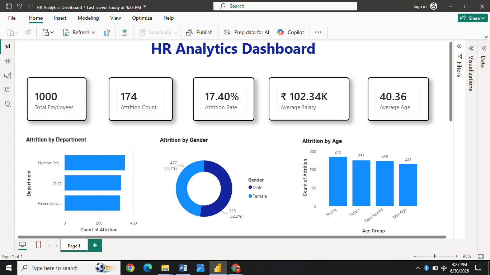
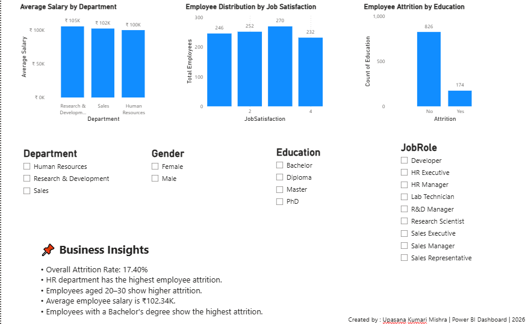

# 📊 HR Analytics Dashboard

An interactive HR Analytics Dashboard developed using **Power BI**, **Power Query**, and **DAX** to analyze employee attrition, workforce demographics, salary distribution, job satisfaction, and education trends.

## 📸 Dashboard Preview

---

## 🎯 Project Objectives

- Analyze employee attrition across departments.
- Monitor workforce demographics.
- Compare average salary by department.
- Evaluate job satisfaction levels.
- Analyze employee attrition based on education.
- Provide interactive filtering for HR decision-making.

---

## 📌 Key KPIs

- 👥 Total Employees
- 🚪 Attrition Count
- 📉 Attrition Rate
- 💰 Average Salary
- 🎂 Average Age

---

## 📊 Dashboard Visualizations

- Attrition by Department
- Attrition by Gender
- Attrition by Age Group
- Average Salary by Department
- Employee Distribution by Job Satisfaction
- Employee Attrition by Education

---

## 🎛 Interactive Filters

- Department
- Gender
- Education
- Job Role

---

## 💡 Business Insights

- Overall Attrition Rate: **17.40%**
- Human Resources department recorded the highest employee attrition.
- Young employees showed relatively higher attrition.
- Average employee salary is approximately **₹102K**.
- Employees with a Bachelor's degree showed the highest attrition.

---

## 🛠 Tools Used

- Power BI
- Power Query
- DAX
- Microsoft Excel

---

## 🚀 Skills Demonstrated

- Data Cleaning
- Data Transformation
- Data Modeling
- DAX
- Dashboard Design
- Data Visualization
- Business Intelligence
- Interactive Reporting

---

## 👩‍💻 Author

**Upasana Kumari Mishra**

⭐ If you found this project useful, please consider giving it a Star.
